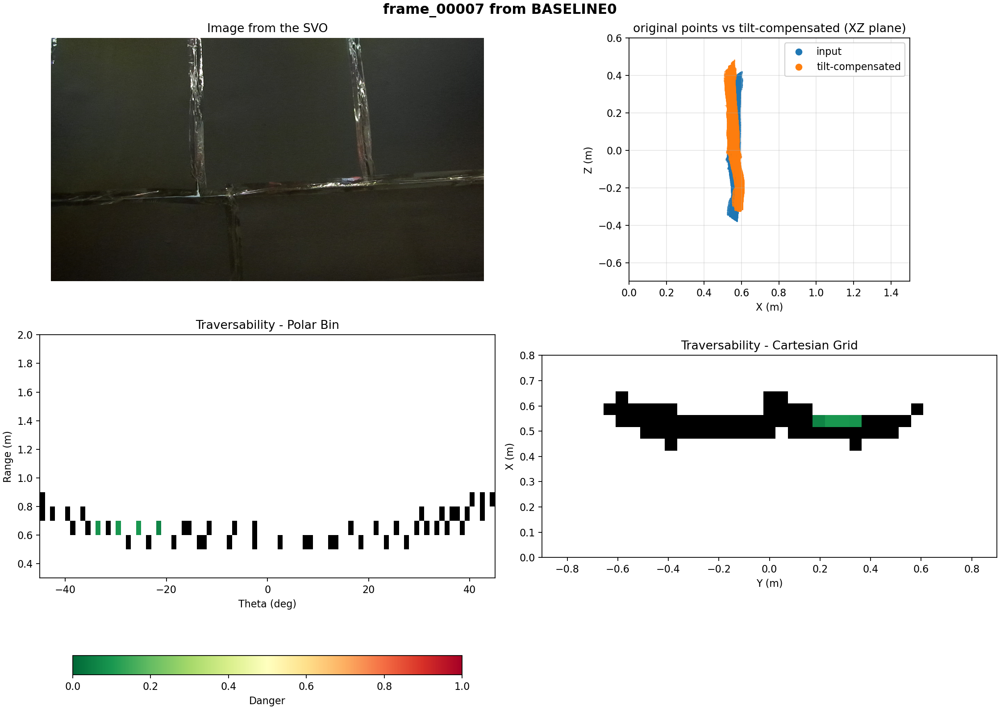
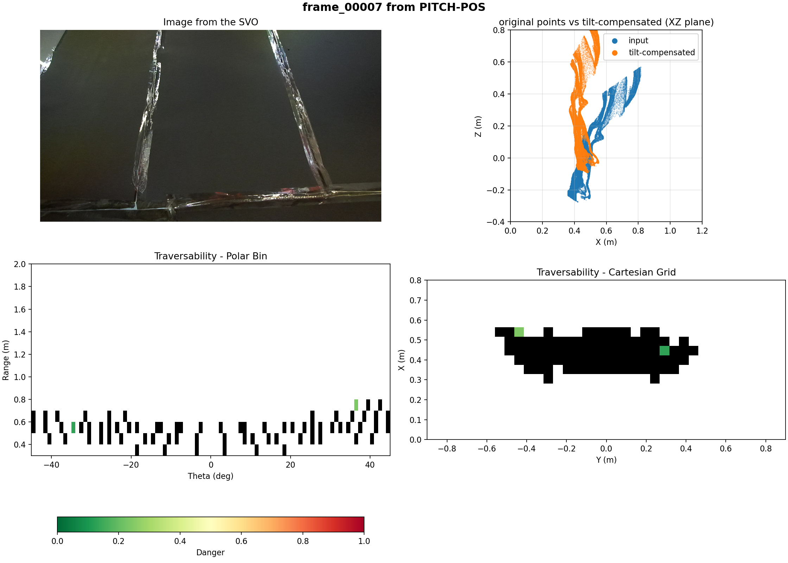

## 1. Experimental Objective

The objective of this experiment is to evaluate system behavior under controlled camera orientation changes while observing a planar wall at close range (0.3-0.4 m).

Specifically, we investigate:

- Sensitivity to pitch, roll, and yaw
- Stability under static vs dynamic motion
- Behavior under single-axis vs multi-axis rotations

## 2. Experimental Setup
### Hardware Configuration

- Camera mounted on tripod
- Distance to planar wall: 0.3-0.4 m
- No intentional translation unless specified
- Rotations manually applied about camera optical center (approximate)

### Coordinate Frame Convention

We define rotations using `RIGHT_HANDED_Z_UP_X_FORWARD` convention:

- Pitch (theta_p): rotation about camera Y-axis
- Roll (theta_r): rotation about camera X-axis
- Yaw (theta_y): rotation about camera Z-axis

All angles are approximate (manual motion).

Find the dataset [here](https://drive.google.com/drive/folders/1hU0xPv-Cs921Qzsj1NfuBcQRYbei3ZNk?usp=sharing)

## 3. Test Matrix
| Test ID | Initial Orientation (Pitch, Roll, Yaw) | Motion Type | Duration | Description |
|---|---|---|---|---|
| BASELINE | (0°, 0°, 0°) | Static | 2 s | Stationary camera |
| PITCH-NEG | (0° -> -45°, 0°, 0°) | Dynamic | 5 s | Continuous negative pitch |
| PITCH-POS | (+45°, 0°, 0°) | Static | 2 s | Stationary at +45° pitch |
| ROLL-NEG | (0°, 0° -> -90°, 0°) | Dynamic | 5 s | Continuous negative roll |
| ROLL-POS | (0°, 0° -> +90°, 0°) | Dynamic | 5 s | Continuous positive roll |
| PTCH_YAW_P | (~ -30°, 0°, 0° -> increasing yaw & pitch) | Dynamic multi-axis | 10 s | Combined pitch & yaw |
| ROLL_YAW_P | (~0°, 0°, 0° -> negative roll + positive yaw) | Dynamic multi-axis | 10 s | Combined roll & yaw |

## Some visuals
1. BASELINE

2. PITCH-NEG
<video src="resources/PITCH-NEG1.mp4" controls width="720"></video>
[Open video](resources/PITCH-NEG1.mp4)

3. PITCH-POS

4. ROLL-NEG
<video src="resources/ROLL-NEG1.mp4" controls width="720"></video>
[Open video](resources/ROLL-NEG1.mp4)

5. ROLL-POS
<video src="resources/ROLL-POS.mp4" controls width="720"></video>
[Open video](resources/ROLL-POS.mp4)

6. PTCH_YAW_P
<video src="resources/PITCH-YAW-P.mp4" controls width="720"></video>
[Open video](resources/PITCH-YAW-P.mp4)

7. ROLL_YAW_P
<video src="resources/ROLL-YAW-P.mp4" controls width="720"></video>
[Open video](resources/ROLL-YAW-P.mp4)
