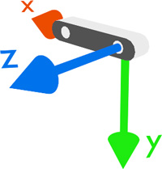

# ZED 2i C++ Application

Minimal, modular ZED 2i application using the official ZED SDK C++ API. The code is organized for easy extension and testing.

## Structure
- `include/` 

    - `camera`
    - `traversability` (work in progress)
- `src/`
    - `camera`
    - `traversability` (work in progress, currenly using Python)
- `tests/` unit + integration tests
- `config/` 

    - example configuration
    - traversability pipeline config
- `resources/` images and videos for doc
- `analysis/` (unnecessary)
- `tools/` Python scripts to process output of the offline traversability pipeline.

## Prerequisites
- ZED 2i camera connected via USB 3.x
- NVIDIA GPU supported by the ZED SDK
- ZED SDK installed (headers + libraries)
- CUDA toolkit compatible with your ZED SDK version
- C++17 compiler (GCC/Clang)
- CMake 3.16+

## Build & Run
```bash
cmake -S . -B build
cmake --build build -j
```

```bash
./build/zed_app --config config/example.conf --iterations=200
```

### Recording output
When recording is enabled, the app writes to `recordings/YYYY-MM-DD_HH-MM-SS/` with:
1. (legacy, might be removed later)
    - `images/` left/right frame images
    - `imu.csv`
    - `odometry.csv`
    - `pointclouds/` (`.ply` per frame)
OR
2. A single `RECORDING.svo` when SVO recording is enabled

### Command-line flags
- `--config <path>` load a config file
- `--enable-frames` / `--disable-frames`
- `--enable-imu` / `--disable-imu`
- `--enable-odometry` / `--disable-odometry`
- `--enable-point-cloud` / `--disable-point-cloud`
- `--record` / `--no-record` start or disable recording
- `--record-toggle` enable keyboard toggling (`r` to toggle, `q` to quit)
- `--record-duration=<seconds>` stop after N seconds
- `--record-frames=<N>` stop after N recorded frames
- `--record-stride=<N>` record every Nth frame
- `--record-image-format=png|jpg`
- `--record-pointcloud-format=ply|svo`
- `--record-root=<path>` output root folder (default `recordings`)
- `--depth-mode=PERFORMANCE|QUALITY|ULTRA|NEURAL`
- `--camera-resolution=HD2K|HD1080|HD720|VGA`
- `--serial=<serial>`
- `--iterations=<N>` run N loops, 0 for infinite (default)
- `--sleep-ms=<N>` sleep between loops (default 5 ms)

Config file note (`config/example.conf`):
- `camera_resolution=HD2K|HD1080|HD720|VGA` (optional; if unset, SDK/default camera resolution is used)

## Tests for the camera 
(no formal unit/ integration tests for traversability pipeline, yet)
```bash
ctest --test-dir build
```

### Integration tests
Set `ZED_TEST_LIVE=1` to enable the live camera integration test:
```bash
ZED_TEST_LIVE=1 ctest --test-dir build -R Integration
```


## Selecting a Coordinate System
The ZED uses a 3D Cartesian coordinate system (X, Y, Z) to express positions and orientations, and it can be configured as right-handed or left-handed. 

By default, the ZED uses the Image Coordinate System: right-handed with +Y down, +X right, and +Z pointing away from the camera. 



You can select a different coordinate system via `sl::InitParameters`:
- `IMAGE` - Right handed, y-down (default)
- `LEFT_HANDED_Y_UP` - Left handed, y-up (Unity 3D)
- `RIGHT_HANDED_Y_UP` - Right handed, y-up (OpenGL)
- `LEFT_HANDED_Z_UP` - Left handed, z-up (Unreal Engine)
- `RIGHT_HANDED_Z_UP` - Right handed, z-up (CADs, e.g., 3DS Max)
- `RIGHT_HANDED_Z_UP_X_FORWARD` - Right handed, z-up, x-forward (ROS - REP 103) 


## Traversabilty
Currently experimenting with a traversability computation pipeline on offline recorded data directly from the ZED camera in svo format. For more on the experiments conducted so far check out [Experiments.md](Experiments.md).
### Traversability pipeline:
1. **Input recording (`.svo`)**
   Use an `.svo` file recorded by the ZED stereo camera, which contains synchronized left/right images and odometry.
2. **Per-frame point cloud generation**
   Decode the `.svo` stream and reconstruct a 3D point cloud for each frame.
3. **Tilt compensation (using odometry)**
   Use the estimated camera orientation to de-tilt each point cloud into a more stable reference frame.
4. **Voxel filtering**
   Downsample the corrected cloud with a voxel grid to reduce noise and computation while preserving structure.
5. **Cartesian-to-polar projection**
   Project the filtered 3D cloud into a polar grid representation suitable for terrain analysis.
6. **Traversability computation**
   Compute traversability from the polar representation.
7. **Output artifacts (`.npz`)**
   Save intermediate/final arrays and metadata in `.npz` format for visualization and analysis.

See [pipeline config](config/pipeline_config.yaml) for tunable parameters and pipeline options.

### Experiment pipeline:

1. Record and label data 
    ```bash 
    ./build/zed_app --record --record-duration=<no-seconds> --enable-point-cloud --record-pointcloud-format=svo --camera-resolution=HD720
    ```
2. Run the traversability pipeline on the recorded data
    ```bash 
    python3 src/traversability/python/run_svo_pipeline.py  recordings/<label>/
    ```
3. Visualize results of experiment
    ```bash 
    python3 tools/svo_offline_summary.py temp-offline-outs/ROLL-YAW-P/ --pc-plane xz
    ```
    Check out [svo_offline_summary.py](tools/svo_offline_summary.py) for optional CLI args.
    ```bash
                                    polar2cartesian.py (plot polar and cartesian traversability grids)
    svo_offline_summary.py  ->   
                                    pointcloud_comparison.py (plot overlay of original & detilted cloud)

    ```
    to-do: improve pointcloud_comparison.py plotting.
